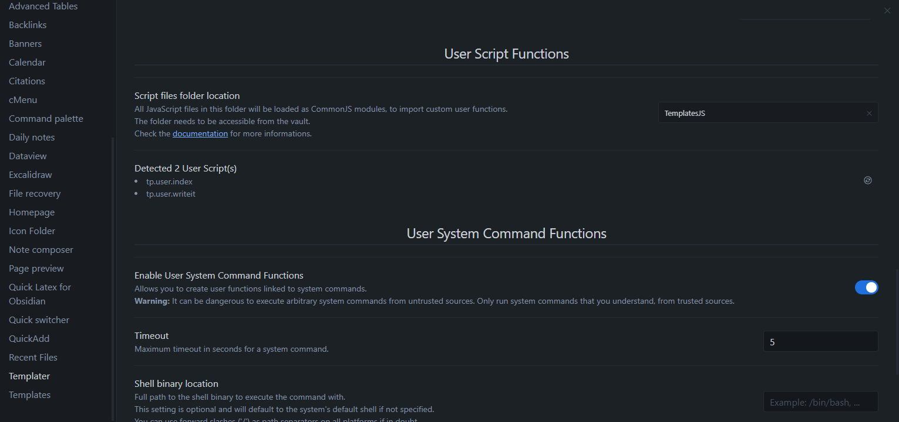
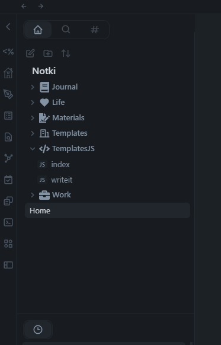

Script which generates index file. Working in [Obsidian.md](https://obsidian.md/)

## Installation

Use the following plugins: [Templater](https://github.com/SilentVoid13/Templater)

Set the default folder for the JS scripts


Copy index.js into this folder


Then under templates create template for index file like

```
<% tp.user.index(tp) %>
```


